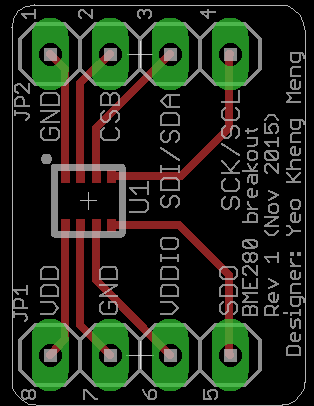
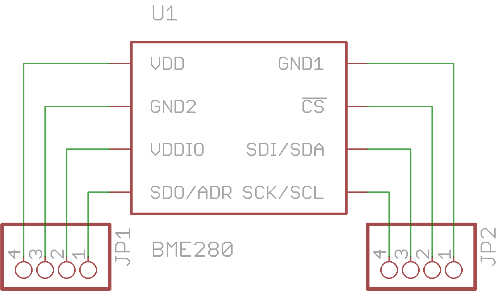

# pcb-bme280-breakout
Pin breakout of the Bosch BME280 sensor to through-hole pin headers for prototyping

##PCB Design software and addons used

1. Eagle 7.4.0: I use Standard but Light should still be able to open/modify the files.
2. BME280 object from [Sparkfun](https://github.com/sparkfun/SparkFun_BME280_Breakout_Board)

##Images
None at this time

##Schematic drawings
Images are exported from Eagle at 600dpi.

##Parts required

The BME280 can be bought from one of the online stores like [Mouser](http://www.mouser.sg/new/bosch-sensortec/bosch-bme280/)
